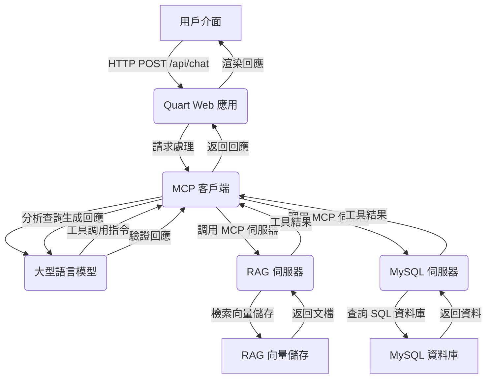
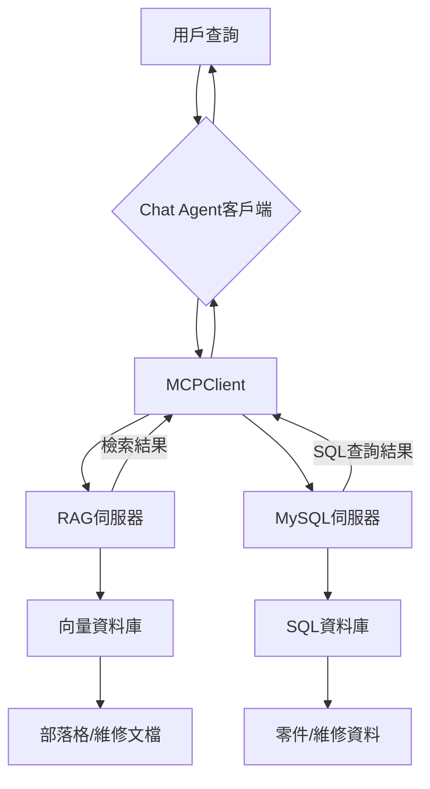
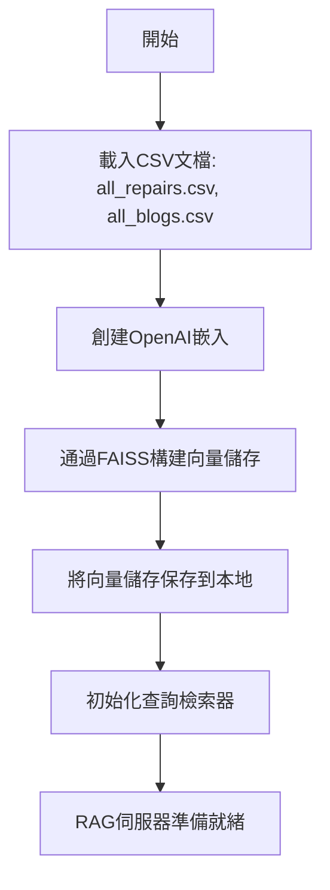
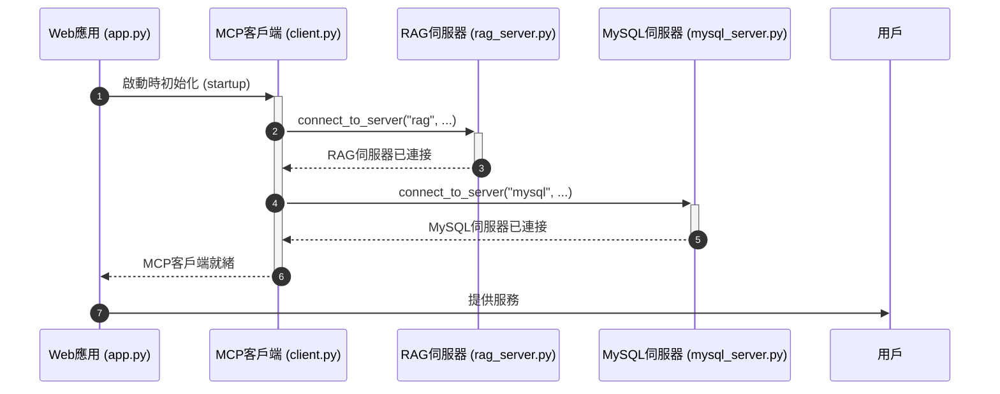

# Wiki Documentation for https://github.com/zehuiwu/partselect-agent

Generated on: 2025-12-05 07:20:42

## Table of Contents

- [專案概述](#page-1)
- [系統架構](#page-2)
- [資料管理與RAG流程](#page-3)
- [環境搭建與部署](#page-4)
- [核心組件實現](#page-5)

<a id='page-1'></a>

## 專案概述

### Related Pages

Related topics: [系統架構](#page-2)

<details>
<summary>Relevant source files</summary>

The following files were used as context for generating this wiki page:

- [README.md](https://github.com/zehuiwu/partselect-agent/blob/main/README.md)
- [lily_client/client.py](https://github.com/zehuiwu/partselect-agent/blob/main/lily_client/client.py)
- [lily_client/models.py](https://github.com/zehuiwu/partselect-agent/blob/main/lily_client/models.py)
- [lily_client/web/app.py](https://github.com/zehuiwu/partselect-agent/blob/main/lily_client/web/app.py)
- [lily_client/web/templates/index.html](https://github.com/zehuiwu/partselect-agent/blob/main/lily_client/web/templates/index.html)
- [mcp_servers/rag/rag_server.py](https://github.com/zehuiwu/partselect-agent/blob/main/mcp_servers/rag/rag_server.py)
- [web-scrapper/scrape_parts.py](https://github.com/zehuiwu/partselect-agent/blob/main/web-scrapper/scrape_parts.py)
</details>

# 專案概述

PartSelect Chat Agent 是一個智能對話系統，旨在協助用戶進行家電零件選擇並提供維修指導。該系統通過結合先進的 RAG（檢索增強生成）技術與 SQL 資料庫整合，為家電維護和維修查詢提供準確、上下文感知的回應。其主要目標是簡化用戶查找正確零件和獲取維修說明的過程，特別專注於冰箱和洗碗機相關的問題。
Sources: [README.md:1-4](), [lily_client/client.py:63-64]()

## 核心功能

PartSelect Chat Agent 提供多項關鍵功能，以增強用戶體驗和查詢處理能力。
Sources: [README.md:6-11]()

| 功能                       | 描述                                                                |
| :------------------------- | :------------------------------------------------------------------ |
| 智能零件識別與定價資訊     | 根據用戶描述或症狀智能識別所需零件並提供價格資訊。                  |
| 逐步維修指導               | 提供詳細的逐步維修說明。                                            |
| 訪問全面的維修文檔和部落格文章 | 允許訪問廣泛的維修指南和相關部落格內容。                              |
| 上下文感知對話處理         | 能夠理解對話上下文，提供更相關的回應。                              |
| 結合 RAG 和 SQL 的智能檢索系統 | 利用 RAG 和 SQL 資料庫的組合進行智能檢索，確保回應的準確性。 |

## 系統架構

PartSelect Chat Agent 的系統架構旨在實現高效的資訊檢索和智能對話生成。它整合了資料庫、檢索流程和聊天循環，以提供無縫的用戶體驗。
Sources: [README.md:13-17]()

以下流程圖展示了系統的主要組成部分及其互動方式：

```mermaid
graph TD
    A[用戶] --> B(聊天介面)
    B --> C{查詢處理}
    C --> D[MCP 客戶端]
    D --> E[查詢分析]
    E --> F{是否需要檢索?}
    F -- 是 --> G[工具調用]
    G -- SQL 查詢 --> H[MySQL 伺服器]
    G -- RAG 搜尋 --> I[RAG 伺服器]
    H --> J[資料庫 (Parts, Blog, Repair)]
    I --> J
    J --> K[檢索結果]
    K --> L[回應生成]
    L --> M[回應驗證]
    M -- 否 --> L
    M -- 是 --> B
    B --> A
```
Sources: [README.md:13-17](), [lily_client/client.py:86-105]()

## 組件概覽

### MCP 客戶端

MCP（Microservice Communication Protocol）客戶端是 PartSelect Agent 的核心協調器，負責管理整個對話流程。它處理用戶查詢、執行分析、調用外部工具、生成回應並驗證其準確性和範圍。
Sources: [lily_client/client.py:27-28]()

`MCPClient` 類包含以下關鍵方法：
*   `analyze_query`: 對用戶查詢進行初步分析，判斷其是否在代理的範圍之內以及是否需要資訊檢索。
*   `retrieve_information`: 根據查詢分析的結果，通過調用 MCP 伺服器上的工具（如 `searchRAG` 或 `execute_read_query`）來檢索相關資訊。
*   `generate_response`: 利用檢索到的資訊和對話歷史，生成對用戶查詢的回應。
*   `validate_response`: 驗證生成的回應是否符合代理的角色、範圍，並檢查是否存在幻覺（hallucination）。
Sources: [lily_client/client.py:152,185,214,244]()

### MCP 伺服器

系統通過 MCP 協議與多個後端服務進行通信，目前主要包括 RAG 伺服器和 MySQL 伺服器。
Sources: [lily_client/web/app.py:52-53]()

#### RAG 伺服器

RAG 伺服器 (`rag_server.py`) 負責執行基於 RAG 的語義搜尋。它維護了維修指南和部落格文章的向量儲存，並使用 OpenAI 嵌入來處理查詢。
Sources: [mcp_servers/rag/rag_server.py:55-56,71-72]()

*   **工具**: `searchRAG` 工具允許客戶端根據給定表（`repairs` 或 `blogs`）和查詢進行語義搜尋。
*   **資料源**: 維修指南 (`repairs.csv`) 和部落格文章 (`blogs.csv`) 被編碼成 FAISS 向量儲存。
*   **嵌入**: 使用 `OpenAIEmbeddings` 生成文檔嵌入。
*   **檢索器**: 每個向量儲存都有一個配置為 `k=5` 的檢索器，用於獲取最相關的文檔。
Sources: [mcp_servers/rag/rag_server.py:25-30,89-103]()

RAG 伺服器的向量儲存創建流程如下：

```mermaid
graph TD
    A[CSV 檔案 (e.g., repairs.csv)] --> B{CSVLoader 載入文檔}
    B --> C[文檔分割]
    C --> D{OpenAIEmbeddings 生成嵌入}
    D --> E[FAISS 創建向量儲存]
    E --> F[本地保存向量儲存]
    F --> G[創建檢索器 (as_retriever)]
```
Sources: [mcp_servers/rag/rag_server.py:55-70]()

#### MySQL 伺服器

MySQL 伺服器 (`mysql_server.py`，雖未直接提供，但其存在和功能由其他檔案推斷) 負責與 `partselect` 資料庫進行互動，執行結構化資料查詢。
Sources: [README.md:39-40](), [lily_client/models.py:15](), [lily_client/web/app.py:53]()

*   **資料庫**: `partselect`。
*   **資料表**: `Parts`（零件資訊）、`Blog`（部落格文章）、`Repair`（維修指南）。這些表用於儲存家電零件、維修指導和相關部落格內容。
*   **工具**: `execute_read_query` 工具（由 `ToolCall` 模型定義）用於執行對資料庫的讀取查詢。
Sources: [README.md:14-15](), [lily_client/models.py:15]()

### Web 介面

用戶通過基於 Quart 框架構建的 Web 介面與 PartSelect Agent 進行互動。
Sources: [lily_client/web/app.py:17]()

*   **前端**: `lily_client/web/templates/index.html` 定義了聊天介面的結構，包括訊息顯示區域和用戶輸入框。它使用 Tailwind CSS 進行樣式設計，並整合 `marked.js` 來解析和渲染 Markdown 格式的聊天回應。
*   **後端**: `lily_client/web/app.py` 提供了 `/api/chat` API 端點，接收用戶查詢，並通過 `MCPClient` 處理後返回回應。它還負責在應用啟動時連接到 MCP 伺服器。
Sources: [lily_client/web/app.py:45-53](), [lily_client/web/templates/index.html:13-16,33-38]()

### 資料抓取器

`web-scrapper/scrape_parts.py` 腳本是一個資料抓取工具，用於從外部網站收集家電零件資訊。
Sources: [web-scrapper/scrape_parts.py]()

*   **主要功能**:
    *   `process_category_page`: 遍歷一個零件類別頁面，識別並提取頁面上所有零件的基本資訊（名稱、連結）。
    *   `scrape_product_details`: 訪問單個零件的產品頁面，抓取詳細資訊，例如零件 ID、MPN ID、價格、安裝難度、安裝時間、症狀、產品類型、替換零件、品牌、可用性和安裝影片 URL。
*   **輸出**: 抓取的資料以字典列表的形式返回，每個字典代表一個零件及其詳細屬性。
Sources: [web-scrapper/scrape_parts.py:14-20,68-70,121-125]()

## 資料模型

`lily_client/models.py` 定義了用於代理內部通信和 LLM 互動的關鍵資料模型。
Sources: [lily_client/models.py:4-30]()

| 模型名稱          | 描述                                                           | 關鍵欄位                                                                                             |
| :---------------- | :------------------------------------------------------------- | :--------------------------------------------------------------------------------------------------- |
| `QueryAnalysis`   | 對用戶查詢的初步分析結果。                                     | `is_in_scope` (是否在範圍), `needs_retrieval` (是否需要檢索)                                         |
| `ToolCall`        | LLM 決定調用的工具及其參數。                                   | `tool_name` (工具名稱), `table_name` (表名), `query` (查詢字串)                                    |
| `BatchToolCall`   | LLM 決定並行執行的一批工具調用。                               | `tool_calls` (工具調用列表), `should_continue` (是否繼續更多工具調用)                               |
| `ToolResult`      | 工具調用的結果。                                               | `tool_name` (調用的工具), `tool_args` (調用參數), `result` (工具返回結果)                          |
| `ResponseValidation` | 對生成回應的驗證結果。                                         | `is_appropriate` (是否恰當), `stays_in_scope` (是否在範圍), `hallucination` (是否存在幻覺), `feedback` (改進反饋) |

## 互動流程

PartSelect Chat Agent 的核心互動流程遵循一個多階段的循環，以確保對用戶查詢的準確和相關回應。
Sources: [lily_client/client.py:86-105]()

```mermaid
sequenceDiagram
    autonumber
    participant 用戶
    participant MCPClient
    participant QueryAnalysisModule
    participant ToolCallingModule
    participant RAGServer as RAG 伺服器
    participant MySQLServer as MySQL 伺服器
    participant ResponseGenerationModule
    participant ResponseValidationModule

    用戶->>+MCPClient: 發送查詢
    MCPClient->>+QueryAnalysisModule: 分析查詢 (query)
    QueryAnalysisModule-->>-MCPClient: QueryAnalysisResult (is_in_scope, needs_retrieval)

    alt 查詢超出範圍
        MCPClient-->>用戶: 抱歉，我只能協助... (預設訊息)
    else 查詢在範圍且需要檢索
        MCPClient->>+ToolCallingModule: 檢索資訊 (query)
        ToolCallingModule->>+RAGServer: searchRAG(table, query)
        RAGServer-->>-ToolCallingModule: RAGResults
        ToolCallingModule->>+MySQLServer: execute_read_query(table, query)
        MySQLServer-->>-ToolCallingModule: SQLResults
        ToolCallingModule-->>-MCPClient: ToolResults (RAGResults, SQLResults)
    end

    MCPClient->>+ResponseGenerationModule: 生成回應 (query, ToolResults)
    ResponseGenerationModule-->>-MCPClient: GeneratedResponse

    loop 最多嘗試3次
        MCPClient->>+ResponseValidationModule: 驗證回應 (query, GeneratedResponse, ToolResults)
        ResponseValidationModule-->>-MCPClient: ResponseValidationResult (is_appropriate, stays_in_scope, hallucination, feedback)

        alt 回應有效
            MCPClient-->>-用戶: GeneratedResponse
            break
        else 回應無效
            MCPClient->>ResponseGenerationModule: 重新生成回應 (query, feedback)
        end
    end
```
Sources: [lily_client/client.py:86-105,185-212,214-242]()

## 總結

PartSelect Chat Agent 是一個全面的智能對話系統，通過整合 RAG 和 SQL 資料庫，為家電零件選擇和維修提供了強大的支援。其模組化架構，包括 MCP 客戶端、RAG 伺服器、MySQL 伺服器和 Web 介面，確保了高效的查詢處理和準確的回應生成。資料抓取器用於豐富其知識庫，而明確定義的資料模型則促進了系統內部各組件之間的順暢通信。通過這種設計，該代理能夠為用戶提供專注且可靠的冰箱和洗碗機維修協助。
Sources: [README.md:1-4,13-17](), [lily_client/client.py:63-64](), [lily_client/models.py:4-30]()

---

<a id='page-2'></a>

## 系統架構

### Related Pages

Related topics: [專案概述](#page-1), [資料管理與RAG流程](#page-3), [核心組件實現](#page-5)

<details>
<summary>Relevant source files</summary>

以下檔案作為生成此維基頁面的上下文：

- [README.md](https://github.com/zehuiwu/partselect-agent/blob/main/README.md)
- [lily_client/client.py](https://github.com/zehuiwu/partselect-agent/blob/main/lily_client/client.py)
- [lily_client/web/app.py](https://github.com/zehuiwu/partselect-agent/blob/main/lily_client/web/app.py)
- [mcp_servers/mysql/mysql_server.py](https://github.com/zehuiwu/partselect-agent/blob/main/mcp_servers/mysql/mysql_server.py)
- [mcp_servers/rag/rag_server.py](https://github.com/zehuiwu/partselect-agent/blob/main/mcp_servers/rag/rag_server.py)
- [lily_client/models.py](https://github.com/zehuiwu/partselect-agent/blob/main/lily_client/models.py)
- [lily_client/web/templates/index.html](https://github.com/zehuiwu/partselect-agent/blob/main/lily_client/web/templates/index.html)
</details>

# 系統架構

PartSelect Chat Agent 是一個智能對話系統，旨在協助用戶進行電器部件選擇和維修指導。該系統結合了先進的 RAG (檢索增強生成) 技術與 SQL 資料庫整合，以提供針對電器維護和維修查詢的準確、上下文感知的回應。其核心是一個基於 Multi-Component Protocol (MCP) 框架構建的分散式架構，實現了前端應用、智能客戶端和多個後端服務之間的解耦與高效通信。

整個系統圍繞用戶互動、智能決策和資料檢索三大核心功能展開，確保了從用戶查詢到最終回應的流暢處理。系統能夠智能識別部件、提供定價資訊、分步維修指導，並訪問全面的維修文檔和部落格文章，從而為用戶提供全面的支援。

## 整體系統架構

PartSelect Chat Agent 的整體架構由幾個關鍵組件組成，這些組件通過 Multi-Component Protocol (MCP) 進行通信和協調。這種設計模式使得系統能夠模組化地管理不同的功能，例如前端互動、核心邏輯處理、RAG 檢索和 SQL 資料庫操作。

以下流程圖概述了系統的高層架構和主要資料流：


Sources: [README.md:9-10](), [lily_client/web/app.py:30-46](), [lily_client/client.py:41-47]()

### 主要組件

#### 1. 前端 (Web Interface)

前端是用戶與系統互動的介面，基於 Quart 框架構建。它負責接收用戶輸入、展示聊天歷史和系統回應。

*   **Quart Web 應用 (`lily_client/web/app.py`)**:
    *   作為系統的入口點，處理 HTTP 請求和回應。
    *   定義 `/` 路由用於渲染 `index.html` 頁面。
    *   定義 `/api/chat` POST 路由來接收用戶查詢並返回聊天回應。
    *   在應用啟動時 (`@app.before_serving`)，初始化 `MCPClient` 並連接到 RAG 和 MySQL 伺服器。
    *   在應用關閉時 (`@app.after_serving`)，清理 `MCPClient` 資源。
    Sources: [lily_client/web/app.py:12-46]()
*   **HTML 模板 (`lily_client/web/templates/index.html`)**:
    *   提供用戶介面的結構，包括聊天輸入框、發送按鈕和聊天訊息顯示區域。
    *   使用 Tailwind CSS 進行樣式設計，並引入 `marked.js` 庫來解析和渲染 Markdown 格式的回應。
    *   包含 JavaScript 邏輯來處理用戶輸入、發送 API 請求、接收並顯示流式回應，以及管理聊天歷史。
    Sources: [lily_client/web/templates/index.html:1-35]()

#### 2. MCP 客戶端 (`MCPClient`)

`MCPClient` (`lily_client/client.py`) 是系統的核心智能代理，負責協調與大型語言模型 (LLM) 和 MCP 伺服器的互動。它管理聊天歷史、執行查詢分析、資訊檢索、回應生成和驗證。

*   **初始化**:
    *   維護與不同 MCP 伺服器的會話 (`self.sessions`)。
    *   使用 `AsyncOpenAI` 客戶端與 LLM (如 GPT-4o) 進行通信。
    *   在初始化時將歡迎訊息添加到聊天歷史中。
    Sources: [lily_client/client.py:22-47]()
*   **伺服器連接**:
    *   `connect_to_server(server_name: str, server_script_path: str)`: 異步連接到指定的 MCP 伺服器，並獲取其暴露的工具列表。支援 Python 和 Node.js 伺服器。
    Sources: [lily_client/client.py:91-115]()
*   **查詢分析 (`analyze_query`)**:
    *   第一次 LLM 調用，判斷用戶查詢是否在系統範圍之內 (`is_in_scope`) 以及是否需要檢索資訊 (`needs_retrieval`)。
    *   使用 `QueryAnalysis` Pydantic 模型來結構化分析結果。
    Sources: [lily_client/client.py:117-142](), [lily_client/models.py:4-8]()
*   **資訊檢索 (`retrieve_information`)**:
    *   根據查詢分析結果，決定需要調用哪些工具（RAG 或 MySQL）來獲取資訊。
    *   使用 `BatchToolCall` 模型來規劃並行工具調用。
    *   將工具調用指令發送給 LLM，獲取具體的工具名稱、表名和查詢參數。
    *   執行工具調用，並將結果記錄在 `ToolResult` 模型中。
    Sources: [lily_client/client.py:144-177](), [lily_client/models.py:16-24]()
*   **回應生成 (`generate_response`)**:
    *   基於用戶查詢和檢索到的工具結果，使用 LLM 生成最終回應。
    *   系統提示詞指導 LLM 作為 PartSelect 的電器部件助手，專注於冰箱和洗碗機部件。
    Sources: [lily_client/client.py:192-209]()
*   **回應驗證 (`validate_response`)**:
    *   使用 LLM 驗證生成的回應是否合適 (`is_appropriate`)、是否在範圍之內 (`stays_in_scope`) 以及是否存在幻覺 (`hallucination`)。
    *   如果回應不合適，LLM 會提供反饋 (`feedback`)，用於指導後續的回應重新生成。
    *   使用 `ResponseValidation` Pydantic 模型來結構化驗證結果。
    Sources: [lily_client/client.py:211-231](), [lily_client/models.py:26-31]()

#### 3. MCP 伺服器

系統通過 MCP 客戶端連接到多個 MCP 伺服器，每個伺服器提供特定的功能。

*   **RAG 伺服器 (`mcp_servers/rag/rag_server.py`)**:
    *   負責處理基於 RAG (檢索增強生成) 的資訊檢索。
    *   **向量儲存**: 使用 `FAISS` 和 `OpenAIEmbeddings` 將 CSV 資料（如維修指南和部落格文章）編碼成向量儲存。如果向量儲存已存在，則載入；否則，創建並保存。
        *   `encode_csv(path, save_path)` 函數實現此邏輯。
        *   當前編碼了 `all_repairs.csv` 和 `partselect_blogs.csv`。
    Sources: [mcp_servers/rag/rag_server.py:19-48]()
    *   **`searchRAG` 工具**: 暴露一個名為 `searchRAG` 的工具，允許客戶端查詢 `repairs` 或 `blogs` 表。
        *   接收 `table` (表名) 和 `query` (查詢字串) 作為參數。
        *   根據表名調用相應的檢索器 (`repairs_query_retriever` 或 `blogs_query_retriever`)。
        *   對檢索到的文檔進行相關性評分 (`GradeDocuments` 模型)，以過濾出最相關的上下文。
    Sources: [mcp_servers/rag/rag_server.py:51-118](), [mcp_servers/rag/rag_server.py:145-148]()
*   **MySQL 伺服器 (`mcp_servers/mysql/mysql_server.py`)**:
    *   負責與 MySQL 資料庫進行互動，執行結構化查詢。
    *   儘管其具體程式碼未提供，但根據 `lily_client/web/app.py` 中對其的連接 (`await client.connect_to_server("mysql", "../../mcp_servers/mysql/mysql_server.py")`) 以及 `lily_client/models.py` 中 `ToolCall` 模型對 `execute_read_query` 工具的定義，可以推斷它提供了一個名為 `execute_read_query` 的工具。
    *   該工具預期能夠接收 SQL 查詢並從 `partselect` 資料庫（包含 `Parts`, `Blog`, `Repair` 表）中檢索資料。
    Sources: [lily_client/web/app.py:38](), [lily_client/models.py:11]()

## 資料流與互動流程

用戶與 PartSelect Chat Agent 的互動遵循一個多階段的循環，涉及前端、MCP 客戶端和後端 MCP 伺服器之間的複雜協作。

以下序列圖詳細說明了從用戶查詢到系統回應的端到端流程：

```mermaid
sequenceDiagram
    autonumber
    participant User as 用戶
    participant Browser as 瀏覽器
    participant WebApp as Quart Web應用
    participant MCPClient as MCP 客戶端
    participant LLM as 大型語言模型
    participant RAGServer as RAG 伺服器
    participant MySQLServer as MySQL 伺服器
    participant VectorStore as 向量儲存
    participant SQLDB as SQL 資料庫

    User->>Browser: 輸入查詢
    Browser->>WebApp: POST /api/chat (query)
    activate WebApp
    WebApp->>MCPClient: chat(query)
    activate MCPClient

    MCPClient->>LLM: analyze_query(query, history)
    activate LLM
    LLM-->>MCPClient: QueryAnalysis (is_in_scope, needs_retrieval)
    deactivate LLM

    alt Query is in scope and needs retrieval
        MCPClient->>LLM: decide_tool_calls(query, history, available_tools)
        activate LLM
        LLM-->>MCPClient: BatchToolCall (tool_calls, should_continue)
        deactivate LLM

        loop For each tool_call in tool_calls
            alt Tool is searchRAG
                MCPClient->>RAGServer: searchRAG(table, query)
                activate RAGServer
                RAGServer->>VectorStore: invoke(query)
                VectorStore-->>RAGServer: docs
                RAGServer-->>MCPClient: relevant_docs
                deactivate RAGServer
            else Tool is execute_read_query
                MCPClient->>MySQLServer: execute_read_query(query)
                activate MySQLServer
                MySQLServer->>SQLDB: execute(query)
                SQLDB-->>MySQLServer: data
                MySQLServer-->>MCPClient: result_data
                deactivate MySQLServer
            end
        end
    end

    loop Max 3 attempts for response generation
        MCPClient->>LLM: generate_response(query, tool_results)
        activate LLM
        LLM-->>MCPClient: response_text
        deactivate LLM

        MCPClient->>LLM: validate_response(query, response_text, tool_results)
        activate LLM
        LLM-->>MCPClient: ResponseValidation (is_appropriate, hallucination, feedback)
        deactivate LLM

        alt Response is valid
            break Loop
        else Response invalid, with feedback
            MCPClient->>LLM: generate_response(query, tool_results, feedback)
            LLM-->>MCPClient: revised_response_text
        end
    end

    MCPClient-->>WebApp: final_response
    deactivate MCPClient
    WebApp-->>Browser: JSON (response)
    deactivate WebApp
    Browser->>User: 顯示回應
```
Sources: [lily_client/web/app.py:48-62](), [lily_client/client.py:107-231](), [lily_client/models.py:7-40]()

## 資料模型

`lily_client/models.py` 定義了在 MCP 客戶端與 LLM 之間以及內部邏輯中使用的 Pydantic 模型，用於結構化資料和工具調用決策。

### QueryAnalysis 模型

用於分析用戶查詢的範圍和檢索需求。

| 欄位          | 類型   | 描述                                     |
| :------------ | :----- | :--------------------------------------- |
| `is_in_scope` | `bool` | 查詢是否關於冰箱或洗碗機部件             |
| `needs_retrieval` | `bool` | 是否需要從資料庫檢索資訊                 |
Sources: [lily_client/models.py:4-8]()

### ToolCall 模型

描述單個工具調用的資訊。

| 欄位          | 類型                                   | 描述                                       |
| :------------ | :------------------------------------- | :----------------------------------------- |
| `tool_name`   | `Literal["searchRAG", "execute_read_query"]` | 要調用的工具名稱 (searchRAG 或 execute_read_query) |
| `table_name`  | `str`                                  | 要搜尋的表名稱 (僅用於 `searchRAG` 工具) |
| `query`       | `str`                                  | 要執行或搜尋的查詢 (用於兩個工具)        |
Sources: [lily_client/models.py:10-14]()

### BatchToolCall 模型

描述一批並行工具調用。

| 欄位            | 類型             | 描述                                 |
| :-------------- | :--------------- | :----------------------------------- |
| `tool_calls`    | `List[ToolCall]` | 要並行執行的工具調用列表             |
| `should_continue` | `bool`           | 此批次後是否繼續進行更多工具調用     |
Sources: [lily_client/models.py:16-19]()

### ToolResult 模型

儲存工具調用的結果。

| 欄位        | 類型   | 描述                       |
| :---------- | :----- | :------------------------- |
| `tool_name` | `str`  | 被調用的工具名稱           |
| `tool_args` | `dict` | 用於工具調用的參數         |
| `result`    | `str`  | 工具返回的結果             |
Sources: [lily_client/models.py:21-24]()

### ResponseValidation 模型

用於驗證 LLM 生成的回應。

| 欄位              | 類型              | 描述                                           |
| :---------------- | :---------------- | :--------------------------------------------- |
| `is_appropriate`  | `bool`            | 回應是否適合作為電器部件助手的回覆             |
| `stays_in_scope`  | `bool`            | 回應是否保持在冰箱和洗碗機部件領域內           |
| `hallucination`   | `bool`            | 回應是否是幻覺或與檢索到的資料衝突             |
| `feedback`        | `Optional[str]` | 如果回應不合適，關於需要改進的反饋資訊 |
Sources: [lily_client/models.py:26-31]()

## 結論

PartSelect Chat Agent 的系統架構採用模組化、分散式設計，以實現高效和智能的電器部件協助功能。其核心在於 MCP 客戶端與多個 MCP 伺服器（RAG 和 MySQL）的無縫互動，並結合 LLM 進行智能查詢分析、回應生成和驗證。這種架構確保了系統的高效性、可擴展性和準確性，通過清晰的職責劃分和資料流管理，為用戶提供了全面的電器部件查詢支援。

---

<a id='page-3'></a>

## 資料管理與RAG流程

### Related Pages

Related topics: [系統架構](#page-2), [核心組件實現](#page-5)

<details>
<summary>Relevant source files</summary>

The following files were used as context for generating this wiki page:

- [data/all_parts.csv](https://github.com/zehuiwu/partselect-agent/blob/main/data/all_parts.csv)
- [data/all_repairs.csv](https://github.com/zehuiwu/partselect-agent/blob/main/data/all_repairs.csv)
- [data/partselect_blogs.csv](https://github.com/zehuiwu/partselect-agent/blob/main/data/partselect_blogs.csv)
- [web-scrapper/scrape_parts.py](https://github.com/zehuiwu/partselect-agent/blob/main/web-scrapper/scrape_parts.py)
- [mcp_servers/rag/rag_server.py](https://github.com/zehuiwu/partselect-agent/blob/main/mcp_servers/rag/rag_server.py)
- [mcp_servers/mysql/mysql_server.py](https://github.com/zehuiwu/partselect-agent/blob/main/mcp_servers/mysql/mysql_server.py)
- [lily_client/client.py](https://github.com/zehuiwu/partselect-agent/blob/main/lily_client/client.py)
- [lily_client/models.py](https://github.com/zehuiwu/partselect-agent/blob/main/lily_client/models.py)
- [lily_client/web/app.py](https://github.com/zehuiwu/partselect-agent/blob/main/lily_client/web/app.py)
- [README.md](https://github.com/zehuiwu/partselect-agent/blob/main/README.md)
</details>

# 資料管理與RAG流程

PartSelect Chat Agent是一個智能對話系統，旨在協助用戶選擇家電零件和提供維修指導。該系統通過結合先進的RAG（檢索增強生成）技術和SQL資料庫整合，為家電維護和維修查詢提供準確、上下文感知的回應。Sources: [README.md:1-4]()

"資料管理與RAG流程"是該系統的核心，負責資料的採集、儲存、索引以及在對話過程中高效檢索相關資訊，從而驅動智能回應的生成。它涵蓋了從原始資料到可檢索向量儲存的轉換，以及如何通過多代理協作（例如，RAG伺服器和MySQL伺服器）來滿足用戶查詢。

## 資料源與採集

系統利用多種資料源來提供全面的家電零件和維修資訊。這些資料主要通過網路抓取獲得，並以CSV格式儲存。Sources: [data/all_parts.csv](), [data/all_repairs.csv](), [data/partselect_blogs.csv]()

主要的資料檔案包括：
*   `all_parts.csv`: 包含各種家電零件的詳細資訊。
*   `all_repairs.csv`: 包含維修指南和相關資訊。
*   `partselect_blogs.csv`: 包含與家電維修相關的部落格文章。

網路抓取腳本（例如`web-scrapper/scrape_parts.py`）負責從PartSelect網站獲取產品資訊，包括零件名稱、URL、ID、品牌、價格、安裝難度、症狀、產品類型、替換零件和安裝影片URL等。Sources: [web-scrapper/scrape_parts.py:100-140]()

### 資料源概覽

| 資料檔案                  | 描述                                     | 範例資料欄位                                     |
| :---------------------- | :--------------------------------------- | :----------------------------------------------- |
| `all_parts.csv`         | 家電零件資訊                             | `part_id`, `mpn_id`, `part_price`, `install_difficulty`, `install_time`, `symptoms`, `product_types`, `brand`, `availability`, `install_video_url`, `product_url` |
| `all_repairs.csv`       | 維修指南和問題解決方案                   | `appliance`, `symptom`, `parts`, `url`, `difficulty` |
| `partselect_blogs.csv`  | 相關的部落格文章                           | `title`, `url`                                   |
Sources: [web-scrapper/scrape_parts.py:100-140](), [mcp_servers/rag/rag_server.py:40-45]()

## RAG資料準備

為了使大型語言模型（LLM）能夠從非結構化資料中檢索資訊，CSV檔案被編碼成向量儲存。核心函數是`encode_csv`，它接受CSV檔案路徑和保存向量儲存的路徑。Sources: [mcp_servers/rag/rag_server.py:1-35]()

### `encode_csv` 流程

`encode_csv` 函數負責將CSV資料轉換為可檢索的FAISS向量儲存，並支援載入現有儲存以提高效率。

```mermaid
graph TD
    A[開始] --> B{向量儲存已存在?};
    B -- 是 --> C[載入現有向量儲存 (FAISS.load_local)];
    B -- 否 --> D[載入CSV文檔 (CSVLoader)];
    D --> E[創建OpenAI嵌入模型 (OpenAIEmbeddings)];
    E --> F[從文檔和嵌入創建FAISS向量儲存 (FAISS.from_documents)];
    F --> G[保存向量儲存到磁碟 (vectorstore.save_local)];
    C --> H[返回向量儲存];
    G --> H;
    H --> I[結束];
```
`encode_csv` 函數的流程圖。Sources: [mcp_servers/rag/rag_server.py:1-35]()

此過程為"repairs"和"blogs"資料創建了專門的向量儲存（例如`repairs_vector_store`和`blogs_vector_store`），並通過`as_retriever`方法轉換為檢索器，用於後續的查詢。Sources: [mcp_servers/rag/rag_server.py:30-33]()

## RAG與MySQL伺服器

系統通過兩個核心的MCP（Multi-Agent Communication Protocol）伺服器來提供資料檢索能力：RAG伺服器和MySQL伺服器。

### RAG伺服器 (`mcp_servers/rag/rag_server.py`)

RAG伺服器是一個基於FastMCP框架構建的MCP服務，它提供了`searchRAG`工具，用於對"repairs"和"blogs"向量儲存進行檢索。Sources: [mcp_servers/rag/rag_server.py:13](), [mcp_servers/rag/rag_server.py:37]()

`searchRAG`工具接收`table`（`repairs`或`blogs`）和`query`作為參數。它通過相應的檢索器（`repairs_query_retriever`或`blogs_query_retriever`）獲取文檔。在返回結果之前，會通過LLM進行文檔相關性檢查（`GradeDocuments`模型），以確保檢索到的文檔與查詢高度相關，並提供置信度分數。Sources: [mcp_servers/rag/rag_server.py:37-100]()

### MySQL伺服器 (`mcp_servers/mysql/mysql_server.py`)

MySQL伺服器是另一個MCP服務，它提供了`execute_read_query`工具，用於執行針對MySQL資料庫的讀取查詢。此伺服器負責與`partselect`資料庫互動，該資料庫包含從`all_parts.csv`等檔案導入的結構化資料。它允許通過SQL查詢直接獲取結構化資料，例如零件的詳細資訊。Sources: [lily_client/models.py:17]() (提及`execute_read_query`工具)

### 可用工具概覽

| 工具名稱               | 描述                                     | 來源檔案                         |
| :------------------- | :--------------------------------------- | :------------------------------- |
| `searchRAG`          | 通過RAG技術搜尋指定表（`repairs`、`blogs`）的查詢。返回相關文檔列表，並包含LLM的相關性評分。 | `mcp_servers/rag/rag_server.py` |
| `execute_read_query` | 執行針對MySQL資料庫的讀取查詢。主要用於獲取結構化資料。 | `mcp_servers/mysql/mysql_server.py` |
Sources: [mcp_servers/rag/rag_server.py:37-100](), [lily_client/models.py:16-17]()

## 客戶端互動與流程

`lily_client/client.py` 中的 `MCPClient` 類是整個對話系統的核心協調器。它負責連接MCP伺服器、管理對話歷史、分析用戶查詢、調用工具以及生成和驗證回應。Sources: [lily_client/client.py:25-35]()

### 查詢處理 (`process_query`) 流程

`process_query` 方法實現了多階段的LLM驅動的推理鏈，以處理用戶查詢並生成最終回應。Sources: [lily_client/client.py:170-200]()

```mermaid
sequenceDiagram
    autonumber
    participant User as 用戶
    participant WebApp as Web應用 (app.py)
    participant MCPClient as MCP客戶端 (client.py)
    participant LLM as 大型語言模型
    participant RAGServer as RAG伺服器 (rag_server.py)
    participant MySQLServer as MySQL伺服器 (mysql_server.py)

    User->>WebApp: 發送查詢 (POST /api/chat)
    WebApp->>+MCPClient: process_query(查詢)
    MCPClient->>LLM: analyze_query(查詢) (QueryAnalysis)
    LLM-->>MCPClient: QueryAnalysis結果 (is_in_scope, needs_retrieval)

    alt 查詢超出範圍
        MCPClient-->>-WebApp: 返回範圍外訊息
    else 查詢在範圍且需要檢索
        MCPClient->>LLM: 規劃工具調用 (BatchToolCall)
        LLM-->>MCPClient: BatchToolCall結果 (tool_calls, should_continue)

        par 並行工具調用
            MCPClient->>+RAGServer: searchRAG(表, 查詢)
            RAGServer->>LLM: GradeDocuments (相關性檢查)
            LLM-->>RAGServer: 評分
            RAGServer-->>-MCPClient: ToolResult (RAG結果)
        and
            MCPClient->>+MySQLServer: execute_read_query(查詢)
            MySQLServer-->>-MCPClient: ToolResult (SQL結果)
        end

        loop 最多3次回應生成/驗證
            MCPClient->>LLM: generate_response(查詢, 工具結果)
            LLM-->>MCPClient: 初始回應
            MCPClient->>LLM: validate_response(查詢, 回應, 工具結果) (ResponseValidation)
            LLM-->>MCPClient: ResponseValidation結果 (is_appropriate, stays_in_scope, hallucination, feedback)
            alt 回應通過驗證
                break
            else 回應不通過驗證
                MCPClient->>LLM: 重新生成回應 (帶反饋)
            end
        end
    end
    MCPClient-->>-WebApp: 最終回應
    WebApp-->>User: 返回回應 (JSON)
```
用戶查詢處理的端到端序列圖。Sources: [lily_client/client.py:170-200](), [lily_client/models.py:12-35](), [mcp_servers/rag/rag_server.py:37-100](), [lily_client/web/app.py:30-45]()

1.  **查詢分析 (Query Analysis):** LLM首先分析用戶查詢，判斷其是否在範圍之內（僅限冰箱或洗碗機零件），以及是否需要從資料庫中檢索資訊。使用`QueryAnalysis` Pydantic模型來結構化此分析結果。如果查詢超出範圍，系統會立即返回預設的拒絕訊息。Sources: [lily_client/client.py:177-184](), [lily_client/models.py:12-14]()
2.  **資訊檢索 (Information Retrieval):** 如果查詢需要檢索，系統會調用`retrieve_information`方法。該方法使用LLM來規劃需要調用的工具（`searchRAG`或`execute_read_query`），並可以並行執行批量工具調用。使用`BatchToolCall`和`ToolCall` Pydantic模型來指導工具調用。執行工具調用並通過`ToolResult`模型捕獲結果。Sources: [lily_client/client.py:186-189](), [lily_client/client.py:116-130](), [lily_client/models.py:16-24]()
3.  **回應生成與驗證 (Response Generation and Validation):** 系統進入一個循環，最多嘗試3次生成和驗證回應。`generate_response`方法利用LLM和檢索到的上下文資訊來生成用戶回應。`validate_response`方法再次使用LLM對生成的回應進行驗證，檢查其是否適當、是否在範圍之內以及是否存在幻覺。使用`ResponseValidation` Pydantic模型來結構化驗證結果。如果回應不通過驗證，系統會根據反饋嘗試重新生成。Sources: [lily_client/client.py:191-200](), [lily_client/client.py:255-270](), [lily_client/models.py:31-35]()

## 核心組件

*   **`MCPClient` (MCP客戶端):** 在`lily_client/client.py`中實現，是整個系統的客戶端入口，負責與MCP伺服器通信，執行多步推理和生成過程。它在初始化時連接RAG和MySQL伺服器，並管理對話歷史。Sources: [lily_client/client.py:25-35](), [lily_client/client.py:150-153]()
*   **`FastMCP` (MCP伺服器框架):** 在`mcp_servers/rag/rag_server.py`中導入並初始化，用於構建MCP伺服器，暴露工具給客戶端。Sources: [mcp_servers/rag/rag_server.py:13]()
*   **`OpenAIEmbeddings` 和 `FAISS`:** 用於將CSV文檔轉換為可高效檢索的向量儲存。`OpenAIEmbeddings`負責生成文檔的向量表示，而`FAISS`是一個高效的相似性搜尋庫，用於儲存和檢索這些向量。Sources: [mcp_servers/rag/rag_server.py:10](), [mcp_servers/rag/rag_server.py:25-27]()
*   **`instructor`:** 一個用於將LLM的非結構化文字輸出解析為Pydantic模型實例的庫，確保了LLM回應的結構化和可靠性。例如，在`analyze_query`和`plan_tool_calls`中用於解析LLM的輸出。Sources: [lily_client/client.py:20](), [lily_client/client.py:207-210]()

## 結論

資料管理與RAG流程是PartSelect Chat Agent的基石，通過結構化和非結構化資料的智能處理，實現了對用戶查詢的準確回應。該流程整合了資料採集、向量化、SQL查詢以及LLM驅動的多階段推理和驗證，確保了系統能夠提供相關、準確且在限定範圍內的家電零件和維修指導。這種混合RAG和SQL的方法，結合嚴謹的LLM驅動的驗證循環，顯著提升了對話系統的可靠性和用戶體驗。

---

<a id='page-4'></a>

## 環境搭建與部署

### Related Pages

Related topics: [專案概述](#page-1)

<details>
<summary>Relevant source files</summary>

The following files were used as context for generating this wiki page:

- [README.md](https://github.com/zehuiwu/partselect-agent/blob/main/README.md)
- [lily_client/client.py](https://github.com/zehuiwu/partselect-agent/blob/main/lily_client/client.py)
- [lily_client/web/app.py](https://github.com/zehuiwu/partselect-agent/blob/main/lily_client/web/app.py)
- [mcp_servers/rag/rag_server.py](https://github.com/zehuiwu/partselect-agent/blob/main/mcp_servers/rag/rag_server.py)
- [lily_client/web/templates/index.html](https://github.com/zehuiwu/partselect-agent/blob/main/lily_client/web/templates/index.html)
</details>

# 環境搭建與部署

PartSelect Chat Agent 專案的環境搭建與部署指南旨在提供一個清晰、全面的步驟，以確保系統能夠正確安裝、配置並運行。該系統是一個智能對話代理，結合了檢索增強生成 (RAG) 技術和 SQL 資料庫整合，用於提供家電零件選擇和維修指導。

本指南涵蓋了從程式碼庫克隆到資料庫設置，再到MCP（多組件協議）伺服器和客戶端應用程式部署的所有必要環節。成功搭建環境是運行和開發 PartSelect Assistant 的基礎。

## 系統架構概覽

PartSelect Chat Agent 採用模組化架構，主要包括一個客戶端應用程式、MCP 伺服器（RAG 和 MySQL）以及後端資料庫。這種設計允許不同組件之間進行有效的通信和職責分離。

以下流程圖概述了系統的主要組件及其互動：


Sources: [README.md]() (for overall architecture concept)

## 環境準備

本節詳細介紹了運行 PartSelect Chat Agent 所需的先決條件和環境配置步驟。

### 前置條件

在開始安裝之前，請確保您的系統滿足以下要求：

*   **Python:** 3.11 或更高版本。
*   **套件管理器:** Conda 或 pip。
*   **版本控制:** Git。

Sources: [README.md]()

### 倉庫克隆與環境啟動

1.  克隆專案倉庫：
    ```bash
    git clone https://github.com/zehuiwu/partselect-agent.git
    cd priceselect-agent
    ```
2.  創建並啟動新的 Conda 環境：
    ```bash
    conda create -n new_env python=3.11
    conda activate new_env
    ```
3.  安裝所需的 Python 套件（通過 `requirements.txt` 檔案）：
    ```bash
    pip install -r requirements.txt
    ```
    Sources: [README.md]()

### 環境變數配置

在專案根目錄創建 `.env` 檔案，並配置以下環境變數。這些變數對於連接外部服務（如 OpenAI、DeepSeek）和資料庫至關重要。

| 變數名稱           | 描述                                     | 範例值                 | 來源檔案                     |
| :--------------- | :--------------------------------------- | :--------------------- | :--------------------------- |
| `OPENAI_API_KEY` | OpenAI API 金鑰，用於模型調用。          | `your_openai_api_key`  | [README.md](), [lily_client/client.py:27]() |
| `DEEPSEEK_API_KEY` | DeepSeek API 金鑰，可選用於模型調用。  | `your_deepseek_api_key`| [README.md]()                |
| `MYSQL_HOST`     | MySQL 資料庫主機地址。                   | `localhost`            | [README.md]()                |
| `MYSQL_PORT`     | MySQL 資料庫埠。                       | `3306`                 | [README.md]()                |
| `MYSQL_USER`     | MySQL 資料庫用戶名稱。                     | `root`                 | [README.md]()                |
| `MYSQL_PASSWORD` | MySQL 資料庫用戶密碼。                   | `your_password`        | [README.md]()                |
| `MYSQL_DATABASE` | MySQL 資料庫名稱。                       | `partselect`           | [README.md]()                |

**注意:** `.env` 檔案應保持私有，絕不能提交到版本控制系統。
Sources: [README.md](), [lily_client/client.py:27]()

## MySQL 資料庫設置

PartSelect Chat Agent 依賴於 MySQL 資料庫來儲存零件和維修資料。以下是設置 MySQL 伺服器和導入資料的步驟。

1.  **安裝 MySQL:**
    *   macOS: `brew install mysql`
    *   Ubuntu: `sudo apt-get install mysql-server`
    *   Windows: 從官方網站下載並安裝 MySQL。
2.  **啟動 MySQL 服務:**
    *   macOS: `brew services start mysql`
    *   Ubuntu: `sudo service mysql start`
    *   Windows: MySQL 服務通常會自動啟動。
3.  **導入資料:**
    *   創建 `partselect` 資料庫：
        ```bash
        mysql -u root -p -e "CREATE DATABASE partselect;"
        ```
    *   導入 CSV 資料檔案：
        ```bash
        mysql -u root -p partselect < data/all_parts.csv
        mysql -u root -p partselect < data/all_repairs.csv
        ```
    Sources: [README.md]()

## MCP 伺服器組件

專案利用 MCP (Multi-Component Protocol) 框架實現不同服務（如 RAG 和 MySQL 介面）之間的通信。MCPClient 負責連接這些伺服器。

### RAG 伺服器

RAG (Retrieval-Augmented Generation) 伺服器負責從向量資料庫中檢索相關文檔，以增強 LLM 生成回應的能力。

RAG 伺服器的初始化流程包括載入 CSV 資料、創建嵌入、構建向量儲存並將其保存到本地。


Sources: [mcp_servers/rag/rag_server.py:29-57]()

RAG 伺服器定義了一個 `searchRAG` 工具，允許客戶端查詢 `repairs` 或 `blogs` 表。
```python
# mcp_servers/rag/rag_server.py
@mcp.tool()
async def searchRAG(table: str, query: str) -> list[str]:
    """Search one of the tables for the query using RAG.
    The tables are:
    - repairs
        - appliance: The appliance that the repair is for.
        - symptom: The symptom or issue that the repair is for.
        - parts: The parts that are needed to fix the issue.
        - url: The URL to the repair guide.
        - difficulty: The difficulty level of the repair.
    - blogs
        - title: The title of the blog post.
        - url: The URL to the blog post.
    Args:
        table: The table to search.
        query: The query to search the table for.
    """
    # ... implementation details ...
```
Sources: [mcp_servers/rag/rag_server.py:65-83]()

### MySQL 伺服器

MySQL 伺服器提供對後端 `partselect` 資料庫的訪問，允許客戶端執行 SQL 讀取查詢以獲取結構化資料。雖然其程式碼實現未在此處提供，但客戶端連接邏輯在 `lily_client/web/app.py` 中有體現。

`lily_client/web/app.py` 中的 `startup` 函數負責連接到 `mysql` 伺服器：
```python
# lily_client/web/app.py
@app.before_serving
async def startup():
    global client
    if client is None:
        client = MCPClient()
        try:
            await client.connect_to_server("rag", "../../mcp_servers/rag/rag_server.py")
            await client.connect_to_server("mysql", "../../mcp_servers/mysql/mysql_server.py")
            logger.info("Successfully connected to required servers")
        except Exception as e:
            logger.error(f"Failed to connect to servers: {str(e)}")
```
Sources: [lily_client/web/app.py:32-41]()

## 客戶端應用部署

客戶端應用包括一個基於 Quart 的 Web 伺服器和一個 `MCPClient` 實例，負責處理用戶請求、與 MCP 伺服器通信並生成回應。

### Web 應用

Web 應用使用 Quart 框架實現異步 HTTP 請求處理。`lily_client/web/app.py` 定義了主應用邏輯，包括路由、伺服器啟動/關閉鉤子以及 `/api/chat` 聊天 API 端點。

```python
# lily_client/web/app.py
from quart import Quart, render_template, request, jsonify, Response
# ... imports ...

app = Quart(__name__)
client = None

@app.before_serving
async def startup():
    # ... connects to MCP servers ...

@app.after_serving
async def shutdown():
    # ... cleans up MCP client ...

@app.route('/')
async def index():
    return await render_template('index.html')

@app.route('/api/chat', methods=['POST'])
async def chat():
    # ... handles chat query ...
```
Sources: [lily_client/web/app.py:16-55]()

### MCP 客戶端

`MCPClient` 類（定義在 `lily_client/client.py` 中）是客戶端應用的核心，負責：
*   載入環境變數。
*   初始化 `AsyncOpenAI` 客戶端。
*   管理聊天歷史。
*   通過 `connect_to_server` 方法連接到 MCP 伺服器（RAG 和 MySQL）。
*   執行查詢分析、資訊檢索、回應生成和驗證的整個對話流程。

客戶端在啟動時連接到 RAG 和 MySQL 伺服器的序列圖如下：


Sources: [lily_client/web/app.py:32-41](), [lily_client/client.py:117-133]()

### 前端 UI

前端用戶介面通過 `lily_client/web/templates/index.html` 定義。它利用 Tailwind CSS 進行樣式設計，並使用 `marked.js` 庫解析和渲染 Markdown 格式的回應。

```html
<!-- lily_client/web/templates/index.html -->
<!DOCTYPE html>
<html lang="en">
<head>
    <meta charset="UTF-8">
    <meta name="viewport" content="width=device-width, initial-scale=1.0">
    <title>PartSelect Assistant</title>
    <link href="https://cdn.jsdelivr.net/npm/tailwindcss@2.2.19/dist/tailwind.min.css" rel="stylesheet">
    <link rel="stylesheet" href="{{ url_for('static', filename='css/style.css') }}">
    <script src="https://cdn.jsdelivr.net/npm/marked/marked.min.js"></script>
    <style>
        /* Custom styles */
        :root {
            --partselect-orange: #E67E22;
            --partselect-teal: #4A7C7C;
            --header-height: 5rem;
        }
        body {
            /* ... styling ... */
            font-family: 'Source Serif Pro', serif;
            padding-top: var(--header-height);
        }
        /* ... more custom styles for markdown content ... */
    </style>
    <script>
        // Configure marked.js
        marked.setOptions({
            breaks: true,
            gfm: true,
            headerIds: false,
            mangle: false
        });
        // ... JavaScript functions for scrolling, response history, etc. ...
    </script>
</head>
<body>
    <!-- ... UI elements ... -->
</body>
</html>
```
Sources: [lily_client/web/templates/index.html:1-85]()

## 總結

PartSelect Chat Agent 的環境搭建與部署涉及多個關鍵步驟，包括 Python 環境設置、必要的 API 金鑰和資料庫憑證配置、MySQL 資料庫的安裝與資料導入，以及 MCP 伺服器和客戶端應用程式的初始化。通過遵循本指南，開發者可以成功地部署專案，並確保其核心 RAG 和 SQL 互動功能能夠正常運行，為用戶提供家電零件選擇和維修指導服務。

---

<a id='page-5'></a>

## 核心組件實現

### Related Pages

Related topics: [系統架構](#page-2), [資料管理與RAG流程](#page-3)

<details>
<summary>Relevant source files</summary>

The following files were used as context for generating this wiki page:

- [lily_client/client.py](https://github.com/zehuiwu/partselect-agent/blob/main/lily_client/client.py)
- [lily_client/models.py](https://github.com/zehuiwu/partselect-agent/blob/main/lily_client/models.py)
- [lily_client/web/app.py](https://github.com/zehuiwu/partselect-agent/blob/main/lily_client/web/app.py)
- [mcp_servers/mysql/mysql_server.py](https://github.com/zehuiwu/partselect-agent/blob/main/mcp_servers/mysql/mysql_server.py)
- [mcp_servers/rag/rag_server.py](https://github.com/zehuiwu/partselect-agent/blob/main/mcp_servers/rag/rag_server.py)
</details>

# 核心組件實現

PartSelect Chat Agent 是一個智能對話系統，旨在幫助用戶選擇家電零件和獲取維修指導。其核心組件實現圍繞多組件協議（MCP）構建，整合了檢索增強生成（RAG）技術和 SQL 資料庫整合，以提供準確、上下文感知的回應。本頁面將詳細介紹客戶端應用程式、MCP 客戶端以及 RAG 和 MySQL 伺服器的關鍵實現細節。

該系統的核心在於 `MCPClient`，它作為中央協調器，處理用戶查詢、與大型語言模型（LLM）互動以進行查詢分析和回應生成，並通過 MCP 協議與專門的 RAG 和 MySQL 伺服器通信以檢索資訊。這種模組化架構提高了系統的可擴展性和可維護性。

## 客戶端 (`lily_client`) 實現

`lily_client` 目錄包含處理用戶介面和與後端 MCP 伺服器通信的核心邏輯。它分為 Web 應用程式和 MCP 客戶端兩部分。

### Web 應用程式 (`lily_client/web/app.py`)

Web 應用程式使用 Quart 框架構建，提供用戶互動介面和 API 端點。

#### 關鍵功能

*   **啟動與關閉**:
    *   `startup` 函數在應用啟動前異步初始化全域 `MCPClient` 實例，並嘗試連接到 RAG 和 MySQL 伺服器。
    *   `shutdown` 函數在應用關閉後異步清理 `MCPClient` 資源。
    Sources: [lily_client/web/app.py:25-42]()
*   **路由**:
    *   `/` 路由提供 `index.html` 頁面作為用戶介面。
    *   `/api/chat` 路由是一個 POST 端點，接收用戶查詢，通過 `MCPClient` 處理，並以流式回應返回。
    Sources: [lily_client/web/app.py:44-59]()

#### 架構概覽

以下流程圖展示了 Web 應用程式與 `MCPClient` 的互動：

```mermaid
graph TD
    A[用戶瀏覽器] --> B{Web 伺服器 (Quart)}
    B -- GET / --> C[index.html]
    B -- POST /api/chat --> D{MCPClient}
    D -- 處理查詢 --> B
    B -- 流式回應 --> A
    subgraph Web 伺服器啟動/關閉
        B -- before_serving --> E[MCPClient.startup()]
        B -- after_serving --> F[MCPClient.shutdown()]
    end
```
Sources: [lily_client/web/app.py:25-59]()

### 核心客戶端邏輯 (`lily_client/client.py`)

`MCPClient` 類是 `partselect-agent` 的核心，負責管理與 LLM 的互動以及與 MCP 伺服器的通信。

#### `MCPClient` 類

*   **初始化**:
    *   維護 `sessions` 字典，儲存與 MCP 伺服器的會話。
    *   使用 `AsyncExitStack` 管理異步上下文資源。
    *   初始化 `AsyncOpenAI` 客戶端，用於 LLM 調用，包括一個用於結構化輸出的 `openai_instructor` 實例和一個用於通用聊天的 `openai` 實例。
    *   維護 `message_history` 列表，儲存對話歷史，並在初始化時添加歡迎語。
    *   `available_tools` 字典儲存從 MCP 伺服器獲取的可用工具。
    Sources: [lily_client/client.py:26-47]()
*   **生命週期管理**:
    *   `connect_to_server(server_name: str, server_script_path: str)`: 連接到指定的 MCP 伺服器，並獲取其提供的工具列表。支援 Python (.py) 和 JavaScript (.js) 伺服器腳本。
    Sources: [lily_client/client.py:91-115]()
    *   `cleanup()`: 關閉所有 MCP 會話並清理資源。
    Sources: [lily_client/client.py:40-42]() (此方法在 `app.py` 的 `shutdown` 中調用)
    *   `reset_chat()`: 重置聊天歷史，但保留介紹資訊。
    Sources: [lily_client/client.py:85-89]()
*   **查詢處理流程 (`process_query`)**:
    這是處理用戶查詢的核心方法，包含以下步驟：
    1.  **查詢分析**: 調用 LLM (`analyze_query`) 判斷查詢是否在範圍之內以及是否需要資訊檢索。
    2.  **資訊檢索**: 如果需要檢索，根據 LLM 決策 (`decide_tool_calls`) 調用 MCP 工具（`searchRAG` 或 `execute_read_query`）。
    3.  **回應生成與驗證**: 循環生成回應 (`generate_response`) 並使用 LLM 進行驗證 (`validate_response`)，直到回應合適或達到最大嘗試次數（3次）。
    Sources: [lily_client/client.py:202-231]()
